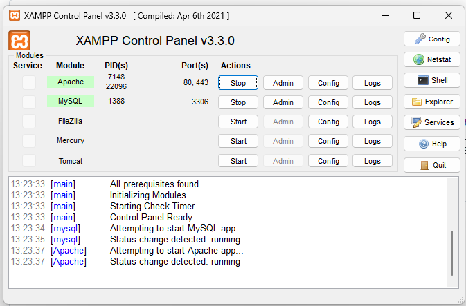
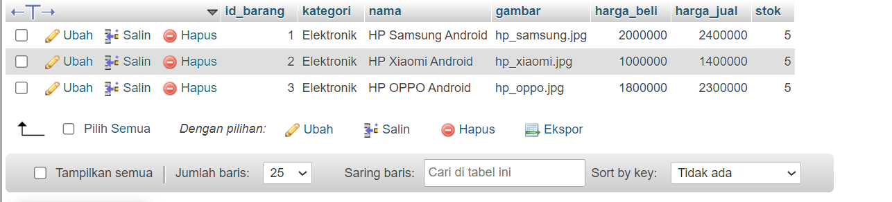
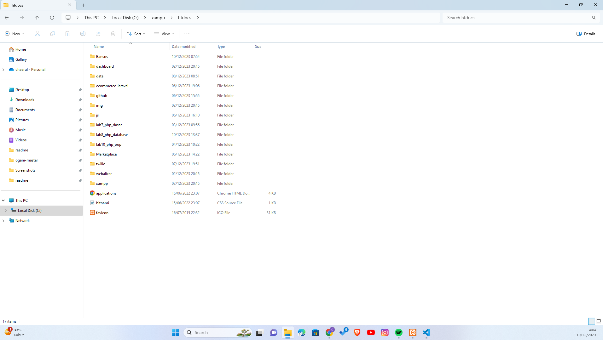
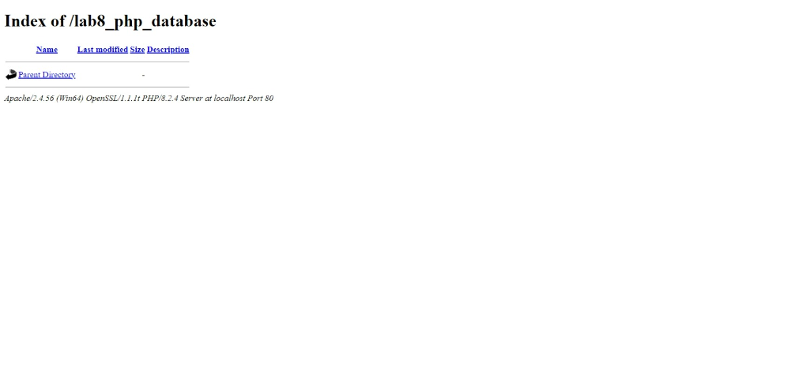
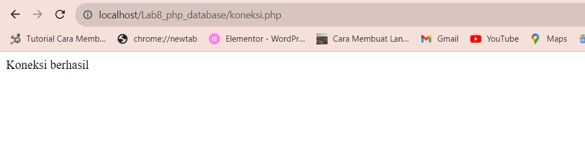
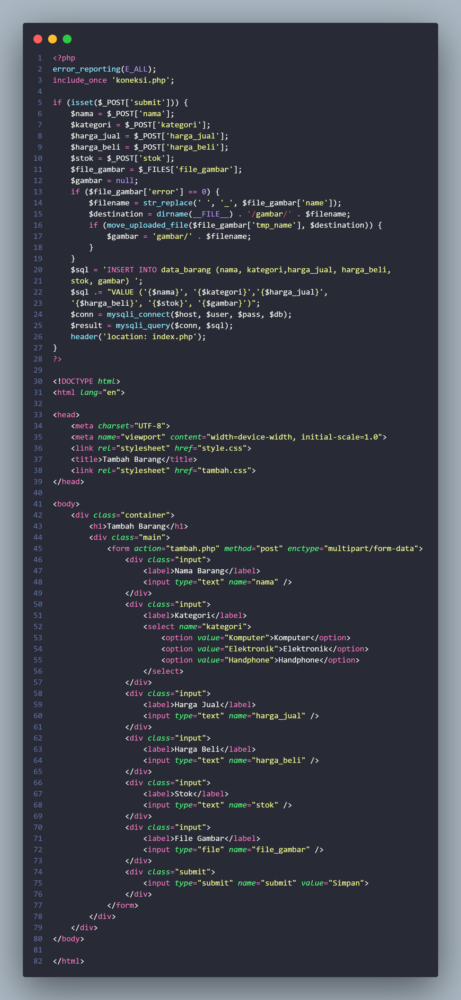
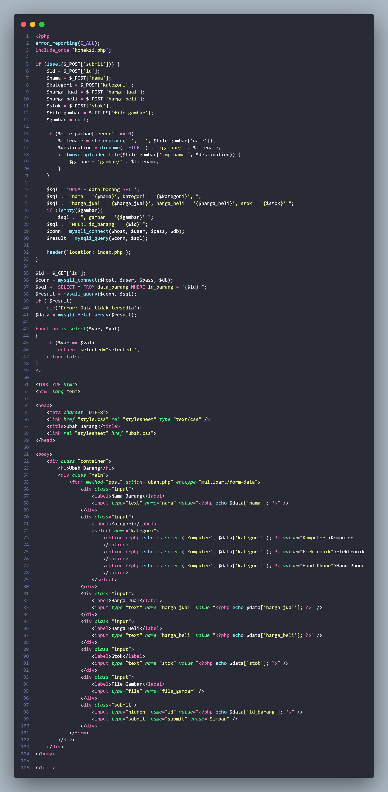
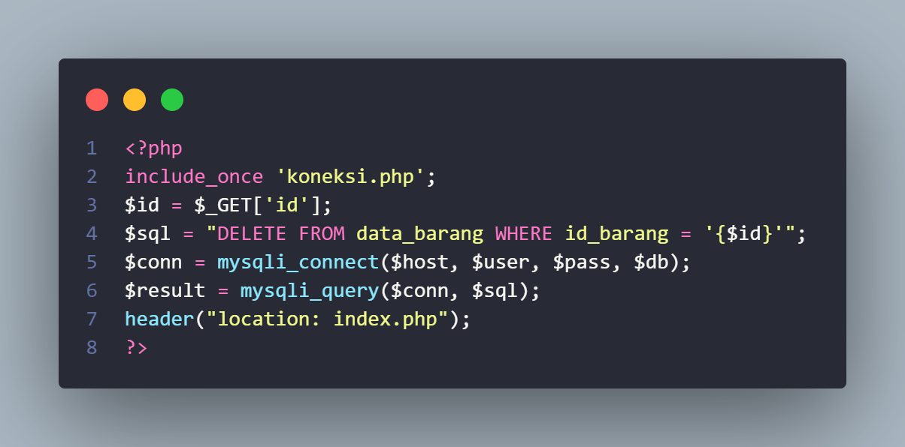

<h1 align="center">Praktikum 8: PHP dan Database MySQL</h1>

=========================================================================== 

 &#128640 <b>NAMA          :  CHAERUL HIDAYAT</b>&#128640   
  &#128640<b>NIM           :  312210300</b>&#128640  
 &#128640<b>Mata Kuliah   :  Pemrograman Web</b>&#128640  

===========================================================================  

## Menjalankan MySQL Server

Jalankan MySQL Server dari menu XAMPP Control.

  

## Mengakses MySQL dari client

Pastikan MySQL dan Apache sudah dijalankan. Setelah itu buka <a href="http://localhost/phpmyadmin/">`http://localhost/phpmyadmin/`</a>

## Database

### Membuat Database

    CREATE DATABASE latihan1;

### Membuat Tabel

    CREATE TABLE data_barang (
    id_barang int(10) auto_increment Primary Key,
    kategori varchar(30),
    nama varchar(30),
    gambar varchar(100),
    harga_beli decimal(10,0),
    harga_jual decimal(10,0),
    stok int(4)
    );

Tampilan PHPMyAdmin

 

### Menambahkan Data

    INSERT INTO data_barang (kategori, nama, gambar, harga_beli, harga_jual, stok) VALUES
    ('Elektronik', 'HP Samsung Android', 'hp_samsung.jpg', 2000000, 2400000, 5),
    ('Elektronik', 'HP Xiaomi Android', 'hp_xiaomi.jpg', 1000000, 1400000, 5),
    ('Elektronik', 'HP OPPO Android', 'hp_oppo.jpg', 1800000, 2300000, 5);

Tampilan Data Barang

  

## Membuat program CRUD

Buat folder lab8_php_database pada directory `c:\xampp\htdocs`

   

akses directory tersebut pada web server dengan URL: <a href="http://localhost/lab8_php_database/">`http://localhost/lab8_php_database/`</a>

  

### Membuat file koneksi databse

buat file dengan nama koneksi.php

        <?php
        $host = 'localhost';
        $user = 'root';
        $pass = '';
        $db = 'latihan1';

        $conn = mysqli_connect($host, $user, $pass, $db);

        if ($conn = false) {
            echo 'Koneksi ke server gagal';
            die();
        } else echo "Koneksi berhasil";

        ?>

   

### Membuat file index untuk menampilkan data (Read)

Buat file bernama index.php  
  
Di sini saya tambah kan css supaya lebih menarik  
Dan ini hasil nya  
   

### Menambah Data (Create)

Buat file dengan nama tambah.php  
 
Dan ini hasil nya  
  

### Mngubah Data (Update)

Buat file dengan nama ubah.php  
 
Dan ini hasil nya  
   

### Menghapus Data (Delete)

Buat file baru dengan nama hapus.php  
   

=========================================================================== 

 &#128640 <b> Terima Kasih </b>&#128640  

===========================================================================  
